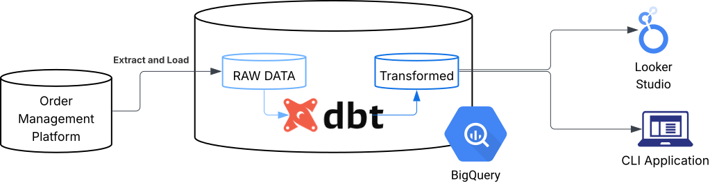

# From Spreadsheets to the Cloud: Automating Revenue Accounting

---

## Overview

Large-scale digital marketplaces generate enormous volumes of financial data — and the accounting processes that support them need to keep up. This project examined that challenge first-hand, diagnosing a fragmented, spreadsheet-heavy operation inside a platform processing hundreds of millions of transactions annually, and delivering a working cloud-based solution to modernise and automate it.

The project was implemented within the platform accounting team at a leading online food delivery platform operating across 17 countries and processing 140+ million orders in 2024 alone. The team's existing system relied on a bespoke ETL script, a customised accounting integration, and extensive manual spreadsheet work — introducing error risk and turnaround times that were no longer viable at this scale.

Following an enterprise architecture gap analysis (TOGAF), the solution was delivered across three work packages: a cloud data model in BigQuery built with dbt, interactive stakeholder dashboards in Looker Studio, and a Python CLI application to automate journal entries, reconciliations, and audit support.

### Results

| Process | Before | After |
|---|---|---|
| Journal entry (per account) | ~60 minutes | < 5 minutes |
| Reconciliation (per account) | ~180 minutes | < 5 minutes |
| Annual labour saving | — | 350+ hours |

**Stack:** Python · SQL (dbt) · JavaScript · Google BigQuery · Google App Scripts · Google Looker Studio · JupyterLab · Git

---

## Components

**Data Model** — A dbt project on Google BigQuery transforms raw order-level transaction events into structured, auditable financial data through five transformation layers. The partner invoicing aggregation layer is materialised as a physical table, reducing query time from 8 minutes to 1 second. 27 data quality assertion models run daily via automated monitoring.

**CLI Application** — `gforevpy` is a Python package that automates end-to-end production of EIB journal files, reconciliation workbooks, and HTML audit workpapers. Built around an abstract base class `Process`, with concrete implementations for journal and reconciliation workflows. All unit and integration tests passed.

**Automated Workflows** — Two Google App Scripts handle continuous monitoring (daily data quality gate before materialisation) and accounting data extraction (Workday REST API → BigQuery), both running on scheduled triggers with email alerting.

**Stakeholder Reporting** — Interactive Looker Studio dashboards connected directly to BigQuery replace ad hoc reporting requests with self-service access to revenue analytics, month-on-month variance analysis, and geographic breakdowns.

---

## 💻 [View full project documentation](https://thabanibiyela.github.io/platform-accounting-public/)
